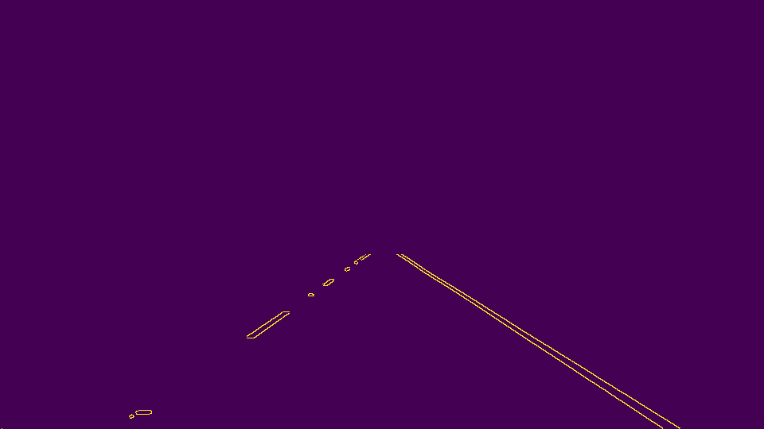
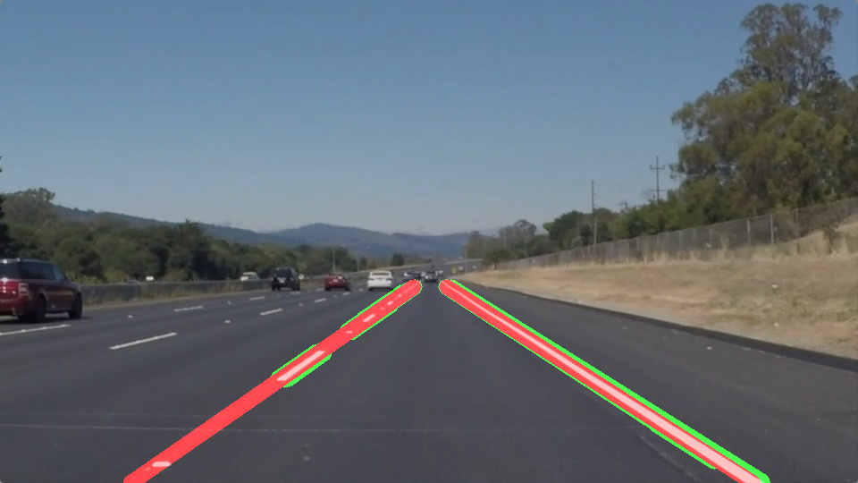

# **Finding Lane Lines on the Road** 

## Overview

**Finding Lane Lines on the Road**

The goals / steps of this project are the following:
* Make a pipeline that finds lane lines on the road
* Enhance the pipleline to average/extrapolate the line segments you detect to map out the full extent of the lane

  

## Reflection

### 1. The pipeline.

My pipeline consisted of 6 phases.

#### Grayscaling

Converting the image to gray scale

    def grayscale(img):
        return cv2.cvtColor(img, cv2.COLOR_RGB2GRAY)
    

 

#### Gaussian smoothing 

    def gaussian_blur(img, kernel_size):
        """Applies a Gaussian Noise kernel"""
        return cv2.GaussianBlur(img, (kernel_size, kernel_size), 0)
        
        
 

#### Canny Edge Detection 

    def canny(img, low_threshold, high_threshold):
        """Applies the Canny transform"""
        return cv2.Canny(img, low_threshold, high_threshold)
        
 

#### Region of interest selection

    def region_of_interest(img, vertices):
        """
        Applies an image mask.
    
        Only keeps the region of the image defined by the polygon
        formed from `vertices`. The rest of the image is set to black.
        """
        #defining a blank mask to start with
        mask = np.zeros_like(img)   
    
        #defining a 3 channel or 1 channel color to fill the mask with depending on the input image
        if len(img.shape) > 2:
            channel_count = img.shape[2]  # i.e. 3 or 4 depending on your image
            ignore_mask_color = (255,) * channel_count
        else:
            ignore_mask_color = 255
        
        #filling pixels inside the polygon defined by "vertices" with the fill color    
        cv2.fillPoly(mask, vertices, ignore_mask_color)
    
        #returning the image only where mask pixels are nonzero
        masked_image = cv2.bitwise_and(img, mask)
        return masked_image
        
 

#### Hough Tranform

    def hough_lines(img, rho, theta, threshold, min_line_len, max_line_gap):
        """
        `img` should be the output of a Canny transform.
        
        Returns an image with hough lines drawn.
        """
        lines = cv2.HoughLinesP(img, rho, theta, threshold, np.array([]), minLineLength=min_line_len, maxLineGap=max_line_gap)
        line_img = np.zeros((img.shape[0], img.shape[1], 3), dtype=np.uint8)
        draw_lines_Ex(line_img, lines)
        return line_img

#### Draw Line (Draw_Line and Draw_Line_Ex)

  This function draws `lines` with `color` and `thickness`. Line coordinate are extrapolated from the inpute lines Lines are drawn on the image inplace (mutates the image).
        
    def draw_lines_Ex(img, lines, color=[[255, 0, 0], [0, 255, 0]], thickness = 15):

        # 1. separating line segments by their slope ((y2-y1)/(x2-x1)) to decide which
        # segments are part of the left line vs. the right line.
        # 2. Store slope, intercept for each line in a list
        leftLanes = []
        rightLanes = []

        for line in lines:
            for x1, y1, x2, y2 in line:
                slope = Slope(x1,y1,x2,y2)
                if (0.4 < slope < 1.0) or (-1.0 < slope < -0.4):
                    intercept = y1 - slope * x1

                    #Debug: Draw individual lines for troubleshooting purposes
                    #cv2.line(img, (x1, y1), (x2, y2), color[1], thickness)
                    if slope > 0 :

                        leftLanes.append((slope, intercept))
                    elif slope < 0:
                        rightLanes.append((slope, intercept))
                else:
                    pass

        # Calculate slope and intercept parameters for (L)eft Lane Linear Function
        (leftLaneSlope, leftLaneIntercept)=tuple(map(lambda y: sum(y) / float(len(y)), zip(*leftLanes)))

        #Substituting the mask top and bottom coordinate to calculate left lane line
        leftLaneY1 = img.shape[0]
        leftLaneX1 = int((leftLaneY1 - leftLaneIntercept) / leftLaneSlope)

        leftLaneY2 = 320
        leftLaneX2 = int((leftLaneY2 - leftLaneIntercept) / leftLaneSlope)

        #Calculate slope and intercept parameters for (R)ight Lane Generalized Linear Function
        (rightLaneSlope, rightLaneIntercept)=tuple(map(lambda y: sum(y) / float(len(y)), zip(*rightLanes)))

        #Substituting the mask top and bottom coordinate to calculate Right lane line
        rightLaneY1 = img.shape[0]
        rightLaneX1 = int((rightLaneY1 - rightLaneIntercept) / rightLaneSlope)

        rightLaneY2 = 320
        rightLaneX2 = int((rightLaneY2 - rightLaneIntercept) / rightLaneSlope)

    
    
    # Draw Left and Right Lane lines

    cv2.line(img, (leftLaneX1, leftLaneY1), (leftLaneX2, leftLaneY2), color[0], thickness)
    cv2.line(img, (rightLaneX1, rightLaneY1), (rightLaneX2, rightLaneY2), color[0], thickness)

___

    cv2.addWeighted() to coadd / overlay two images cv2.cvtColor() to grayscale or change color cv2.imwrite() to output images to file
    cv2.bitwise_and() to apply a mask to an image

 

### 2. Potential shortcomings with the current pipeline

  This approach is not resilient to the following conditions:
   - Shadows, Weather and Light condition
   - Curved lanes
   - Street imperfections (faded lanes, missing lanes)..

### 3. Possible improvements

A possible improvement would be to ...

   - Use of a better color selection approach to handle different lighting conditions.
   - Support other street markings.
   - Adaptive estimation of street lane based on historical data to compensate for  street imperfection (possibley using Kalman Filter - LQE)
   
   
### Results

#### Solid White Right

Results for solid white right lane video

 

#### Solid Yellow Left

Results for solid yellow left lane video

 

#### Challenge

This pipeline didn't work with the challenge video, possibly because this video introduced the following:
1. Curved lanes 
2. Tree shadows

 
